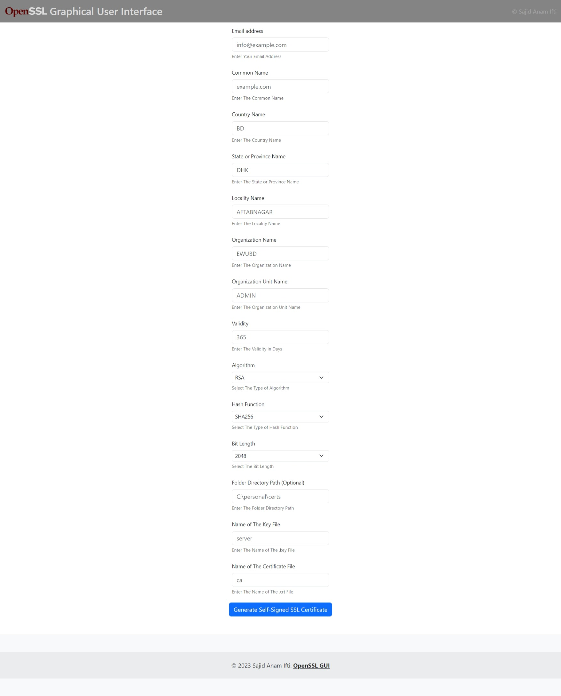

# A Simple Graphical User Interface for OpenSSL Using Python and Django

A simple and basic web-based front end for OpenSSL created with Django. It is a way to generate SSL certificates quickly for personal use.
<br><br><br>
To run this application, you need <strong>Python 3.10+</strong> and some packages installed.<br>
Run:<br>

```bash
pip install django pyopenssl
```

or

```bash
pip install -r requirements.txt
```

<br>

After installing essential packages, go to the project folder and open a terminal window.<br>
Run:<br>

```bash
python manage.py runserver
```

<br>
Then go to http://127.0.0.1:8000

## UI Screen Shot


